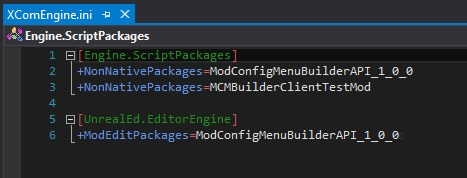

## JsonConfig Manager
The JsonConfig Manager introduces a new method of defining config values as json string.

#### Integration
You will need to add the package
**ModConfigMenuBuilderAPI_1_0_0** from **ModConfigMenu** to your mod project




You mod will be dependend on the ModConfigMenu mod and the funtionality will only work if MCM is active.

#### Usage
```
[FancyModManagerName JsonConfig_ManagerDefault]
+ConfigProperties = {"BAR":{"Value":"Foo"}}
```
these config values can be accessed like
```
local JsonConfig_ManagerInterface ConfigManager;

ConfigManager = class'ConfigFactory'.static.GetConfigManager("FancyModManagerName");
ConfigManager.GetConfigStringValue("BAR")
```

The advantage over regular config properties is that they can be accessed by string identifiers which makes automatic localization tag generation and mapping in the MCMBuilder possible.

#### Current type support
currently supported accessors/types are

```
string GetConfigStringValue
int GetConfigIntValue
float GetConfigFloatValue
name GetConfigNameValue
byte GetConfigByteValue
bool GetConfigBoolValue
array<int> GetConfigIntArray
array<float> GetConfigFloatArray
array<name> GetConfigNameArray
array<string> GetConfigStringArray
vector GetConfigVectorValue
WeaponDamageValue GetConfigDamageValue
string GetConfigTagValue
```

more support for common X2 structs is planned.

#### Tag generation

There are a whole bunch of meta attributes you can use for localization tag generation. Here are some example:

```
+ConfigProperties = {"ACTIVIST_DETECTION_MOD":{"Value":"-5", "TagFunction":"TagValueMetersToTiles"}}
+ConfigProperties = {"ACTIVIST_DETECTION_MOD_CIVS":{"Value":"0.5", "TagFunction":"TagValueToPercent", "TagSuffix": "%"}}
+ConfigProperties = {"AGRESSION_CRIT_CHANCE":{"Value":"5", "TagPrefix":"+"}}
+ConfigProperties = {"AGRESSION_SCALE_MAX":{"Value":"6", "TagPrefix":"+", "TagFunction":"TagValueParamMultiplication", "TagParam":"AGRESSION_CRIT_CHANCE"}}
+ConfigProperties = {"AIRSTRIKECHARGES":{"Value":"1"}};
+ConfigProperties = {"AIRSTRIKEDAMAGE":{"DamageValue":{"Damage": 10, "Spread": 2, "Shred": 3, "DamageType":"Explosion"}}}
+ConfigProperties = {"ANARCHIST_CHARGES":{"Value":"1"}}
+ConfigProperties = {"ANARCHIST_CRIT":{"Value":"2", "TagPrefix":"+", "TagSuffix":"%"}}
+ConfigProperties = {"ANARCHIST_CRIT_MAX":{"Value":"50", "TagSuffix":"%"}}
+ConfigProperties = {"ARCTHROWER_ABILITIES":{"ArrayValue":"ArcThrowerStun, EMPulser, ChainLightning"}}
```

The mapping code in client mods DLCInfo class just looks like this:

```unrealscript
static function bool AbilityTagExpandHandler(string InString, out string OutString)
{
	local string PossibleValue;
	local JsonConfig_ManagerInterface ConfigManager;

	ConfigManager = class'ConfigFactory'.static.GetConfigManager("FancyModManagerName");
	PossibleValue = ConfigManager.GetConfigTagValue(InString)

	if (PossibleValue != "")
	{
		OutString = PossibleValue;
		return true;
	}

	return false;
}
```
For the tag generation add the AbilityTagExpandHandler code snippet above to you DLCInfo file.

#### Complete Example:

Config:
```
+ConfigProperties = {"MILITIA_AIM":{"Value":"3", "TagPrefix":"+"}}
+ConfigProperties = {"MILITIA_RANGE_MULTIPLIER":{"Value":"0.5", "TagPrefix": "-" , "TagFunction":"TagValueToPercent"}}
+ConfigProperties = {"MILITIA_SIGHT_RADIUS":{"Value":"3", "TagPrefix":"+", "TagSuffix":" tiles", "TagFunction":"TagValueMetersToTiles"}}}
```

Usage:
```unrealscript
// Best to put this in a static helper class somewhere
static function JsonConfig_ManagerInterface GetJsonConfig()
{
	return class'ConfigFactory'.static.GetConfigManager("FancyModManagerName");
}

static function X2AbilityTemplate Militia()
{
	local X2AbilityTemplate				Template;
	local X2Effect_RangeMultiplier			RangeEffect;
	local X2Effect_PersistentStatChange		Effect;

	RangeEffect = new class'X2Effect_RangeMultiplier';
	RangeEffect.RangeMultiplier = GetJsonConfig().GetConfigFloatValue("MILITIA_RANGE_MULTIPLIER");
	RangeEffect.BuildPersistentEffect(1, true, false, false);

	Template = Passive('APT_Militia', "img:///UILibrary_PerkIcons.UIPerk_Urban_Aim", true, RangeEffect);

	Effect = new class'X2Effect_PersistentStatChange';
	Effect.AddPersistentStatChange(eStat_Offense, GetJsonConfig().static.GetConfigIntValue("MILITIA_AIM"));
	Effect.AddPersistentStatChange(eStat_SightRadius, GetJsonConfig.static.GetConfigIntValue("MILITIA_SIGHT_RADIUS"));

	AddSecondaryEffect(Template, Effect);

	return Template;
}
```

Localization:
`LocLongDescription="A militia marksman from one of the Resistance camps we saved. Has <Ability:MILITIA_AIM/> aim and <Ability:MILITIA_SIGHT_RADIUS/> sight radius, and <Ability:MILITIA_RANGE_MULTIPLIER/> weapon range penalties."`

Expanded String:
`A militia marksman from one of the Resistance camps we saved. Has +1 aim and +2 tiles sight radius, and -50% weapon range penalties.`

#### TagFunctions:
There are some predefined functions you can use in tag generation and to convert values on the fly:

- TagValueToPercent
- TagValueToPercentMinusHundred
- TagValueMetersToTiles
- TagValueTilesToMeters
- TagValueTilesToUnits
- TagValueParamAddition
- TagValueParamMultiplication
- TagArrayValue

usage for tag generation:
`+ConfigProperties = {"MILITIA_RANGE_MULTIPLIER":{"Value":"0.5", "TagFunction":"TagValueToPercent"}}`

usage for converting values in code:
`ConeMultiTarget.ConeEndDiameter = GetJsonConfig().static.GetConfigIntValue("SPRAY_TILE_WIDTH", "TagValueTilesToUnits");`
